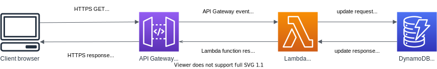

# Cloud Resume Challenge - Serverless backend

This project is part of my attempt on [Cloud Resume Challenge](https://cloudresumechallenge.dev/)
- [Static web frontend](https://github.com/luzhkovvv/cloudresumesite)
- Serverless backend - this project
- [CI/CD pipelines](https://github.com/luzhkovvv/cloudresumepipelines)

This project is built on AWS SAM using [AWS Toolkit for Visual Studio Code](https://aws.amazon.com/visualstudiocode/) and may be deployed by [SAM CLI](https://github.com/aws/aws-sam-cli). It includes the following files and folders:
- counter - code for lambda function;
- events - test events;
- tests - pytest tests;
- template.yaml - SAM template for Lamdba, DynamoDB and API Gateway
- unit-tests-buildspec.yaml - CodeBuild spec for running tests
- buildspec.yml - CodeBuild spec for building SAM application

## Architecture

This project following AWS services:
- API Gateway - to accept connections from frontend JS code running in client browser;
- Lambda - to process requests, store, update and retrieve data from DynamoDB table;
- DynamoDB - to store data.

Logical diagram of solution:

### API Gateway

HTTP API is used as more recent API type, offering automatic CORS handling, increased performance and simplified configuration within SAM template. Feature set of HTTP Gateway is appropriate for requirement. Single API with single path and method - `/counter` and `GET` is used. Additional API features are enabled:
- CORS configuration, allowing all methods from all origins, automatically adds `access-control-allow-origin: *` header to HTTP response;
- Throttling limits load to 10 requests/sec to withstand possible attacks and stay within Free Tier.

### Lambda function

Lambda function is written in Python, `python3.8` environment is used, uses boto3 client to access dynamodb table and perform update operation. Environment variables are used for DynamoDB endpoint and table name to allow local development and coexistence of multiple environments. Default `DynamoDBWritePolicy` policy is used for execution role with access to corresponding table.

### DynamoDB table

Table with single key attribute *path* of type *string* used to store per-path records of current counter values, to achieve reusability. Counter value is stored in attribute *hits* of type *number*. Table capacity mode is On-Demand (`PAY_PER_REQUEST`), as expected load is near to zero.

### CloudFormation stack

CloudFormation is used to deploy whole environment, with help of SAM, translating SAM template to CloudFormation template on build stage. All important parameters, including counter function execution URL are returned as stack outputs.

## Development, testing and deployment

This project is fully compatible with AWS SAM CLI, which may be used for running and debugging Lambda function locally, as well as AWS Toolkit for Visual Studio Code. Custom DynamoDB emulation may be used for development by specifying `DYNAMODB_ENDPOINT` and `DYNAMODB_TABLE` environment variables, [localstack](https://github.com/localstack/localstack) installed in docker container was used during development.
Testing is based on [pytest](https://pytest.org) in conjunction with [moto](https://github.com/spulec/moto) library for DynamoDB emulation.
This project is designed to be automatically tested, built and deployed by appropriate CI/CD pipelines. Manual deployment may be performed using SAM CLI.

## Usage

This project is designed to be used in conjunction with corresponding Static Web Frontend project, although is supports counting any strings by invoking HTTP GET method on `https://<APIID>.execute-api.<REGION>.amazonaws.com/counter?path=<PATH>`, where `<PATH>` is string to count (supposedly, host+path for webpage counter is applied to)
